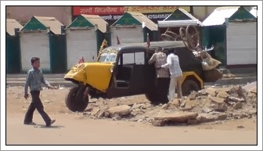

Every time I visit my in-laws and see one of these **“Bhat Suar”** (three-wheeler carts) on the road, it brings back memories of my college days. Durg (my in-law’s place) and Bhopal (my college days) were part of the same state six years ago. Although politically divided, they are very similar to an outsider like me in terms of social and geographical aspects.

The first part of the name comes from the sound they make, ***“Bhat-Bhat,”*** and the second part, ***“suar,”*** means pig ( pig face like front portion ) . The design varies from state to state, and its mechanism is very simple and rigid for extreme conditions. Maintenance is straightforward—all you need to do is open the hood and fix it; no complicated electronics, just big mechanical parts.

Before coming to Bhopal, I had never seen these big yellow tempos (tutuk). Sometimes, they are the de-facto public transport in central India. In these areas, where public bus service is inadequate or nonexistent and a small auto for a single person is expensive, they are very popular as they are engineered to accommodate around 12-15 people. Memories of these bone-rattlers on uncomfortable pothole-filled roads will remain for a long time. The conductor will always try to squeeze in another passenger, chanting, **"Khasko bhai khasko"** (convince to make more room). **"Ab kahaan khaskein"** ("Now, where do I shift?") would be the apt reply.

 It used to make bhat bhat sound and had a pig  (Suar) . Hence, called Bhat Suar.