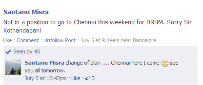
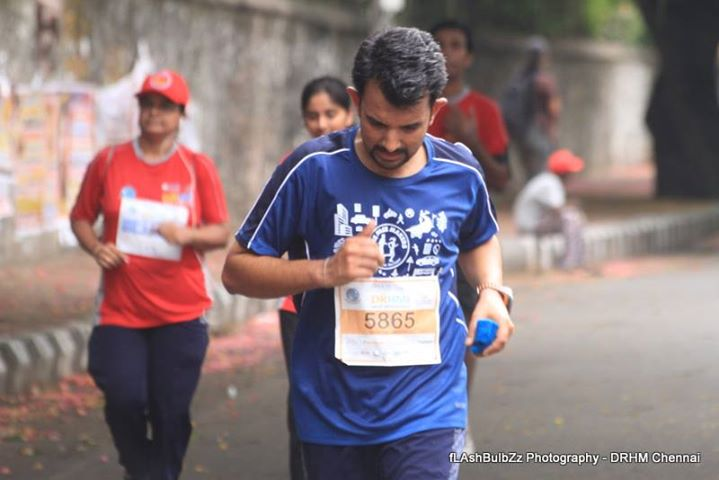

The Chennai Dream Runners Half Marathon ([DRHM](http://www.dreamrunners.in/ "Chennai Dream Runners")) marked a significant event for me, taking place on the 1st Sunday of July, specifically the 7th of July 2013. This was a race that drew me out of Bangalore, a city I had been calling home. The last time I registered for a marathon was in 2008 in Mumbai, and I was blessed with the arrival of Aarush just a few days before the race, which obviously led to a change in my plans. It was the presence of Aarush that prevented me from engaging in weekday morning runs, but he also served as the catalyst for my introduction to The Pacemakers, a prominent running group in Bangalore.

A huge shoutout to Pamela for her unwavering support in making this escape from my daily Bangalore routine possible. I knew it wouldn't be my best run, given that I hadn't been practicing at all. My last run was at the beginning of June, and since then, life had been a whirlwind of household chores and office work, late nights, weekends filled with work, and the busy schedule of Aarush's school activities. In fact, I was so unsure about participating that I initially posted on The Pacemakers' Facebook page that "I am not going." However, thanks to Pamela's encouragement, I changed my tune an hour later, posting that "I will" be going after all.

 

Our journey to Chennai began with the help of fellow runners who booked a cab for us. We woke up at the crack of dawn, around 4:30 AM, and met them at the gate by 5. By 5:40, we had reached Containment Station, where a few more fellow runners were already waiting. At 6:10, we boarded the Shatabdi. The train journey was a blast, reminiscent of my college days when traveling in large groups was the norm. It was a joy to be noisy and partake in so many small group conversations—it was truly entertaining.

As soon as we reached Chennai, we were greeted by the sweltering, humid heat and the distinctive scent of Chennai Central. Thanks to our Tamil friends, we made our way to the electrical (local) train platform and hopped on a local train heading to our hotel. The last leg of the journey, from the station to the Raj Palace hotel, was quite a long walk. Along the way, we passed by numerous ministerial bungalows, adding a unique charm to our journey.

Upon reaching the hotel, the collective hunger of over 30 stomachs led to a lively debate about where and what to have for lunch. I personally decided to stay back and dine at the hotel, followed by a long nap until evening. Wimbledon was in full swing, with the ladies' final being the highlight of the day. Our room soon filled up with more than 20 people, as watching tennis in a group is always more fun. Everyone expected a fierce battle between a German and a French player. However, Bartoli surprised us all by swiftly winning the tournament in straight sets, acing her way to victory. While she didn't defeat any big names in this tournament, she certainly conquered those who did—a dream come true for her.

 

The Chennai DRHM turned out to be more than just a marathon; it was an adventure filled with camaraderie, excitement, and memorable moments.