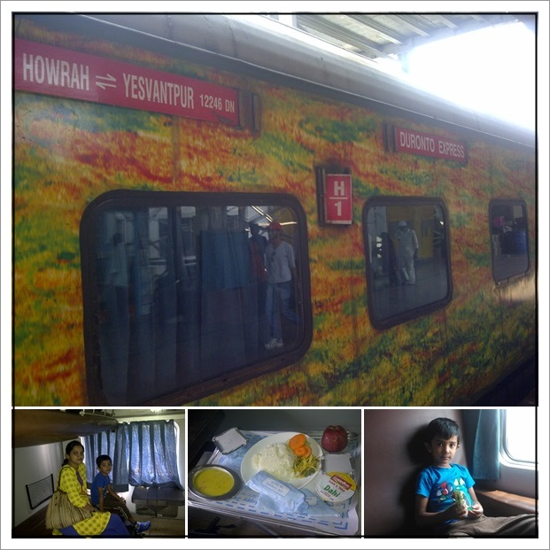

It had been a long-time dream of mine to travel in 1st class on Indian Railways. The last time I had the pleasure of such an experience was way back in early 1985 when we embarked on a trip to [Puri, a must-visit for Bengalis](http://blog.santm.com/image_article/puri-family.jpg "/puri-family"). So, when the dates for our summer vacation were confirmed, I wasted no time and started booking our train tickets. It was December when we secured tickets for an April journey. Initially, I intended to book 2nd AC tickets, but to my surprise, they were already sold out. So, I opted for AC 1st Class. The price of AC 1st class is almost like airfare, but on the positive side, you get a personal cabin or coupe, along with excellent food and service. However, it still takes a long time to travel between Bangalore and Calcutta—2.5 hours by flight compared to 28 hours on the fastest train, known as the Duronto (quick). 

We had a simple wish—to secure a coupe for ourselves. Unlike other classes, when you book an AC 1st Class ticket, you don't get a seat number immediately. You only receive it approximately 4 hours before the train's departure when the railway prepares the boarding chart. After conducting some online research, a gentleman suggested a clever way to ensure we'd have the coupe to ourselves. His idea was to visit the boarding railway station and get a special ticket for your pet at a minimal price. This way, the railway wouldn't allocate your coupe to other passengers, and on the day of the journey, you could always say you left your pet behind with a friend.

 

### The Journey Begins

The day of our journey started with two unpleasant surprises. First, our maid called to inform us that she wouldn't be coming. Pamela had to quickly take charge, cleaning the house and the dishes as she prepared for her nearly 4-week-long trip. The second surprise was a rash on Aarush's back, which left us puzzled. It wasn't an ideal start, as we were uncertain about the cause of the rash. Our pre-booked taxi arrived early, and to our amazement, we reached Yashwantpur railway station swiftly. We had to endure an hour of waiting under the scorching heat, which served as a warm-up for the blistering summer that awaited us once we left Bangalore.

The train departed on time, and we were greeted with red roses and wet tissues from the onboard staff. They promptly handed out water bottles, informed us about the upcoming soup service, and checked if we needed anything before that. The food was outstanding and was served with proper cutlery on foldable tables. They even returned to inquire if we desired any additional items during lunch. We savored an Indian lunch and a continental dinner, with snacks, tea, coffee, and soups available in between.

The journey was truly relaxing, just as I had hoped, until we reached Cuttack in Orissa the following day. There, our train, along with other trains including the Rajdhani, came to a standstill for two hours due to a protest by local residents demanding the construction of an overbridge. This unexpected delay dampened our spirits. Passengers began to grow restless, and a dramatic scene unfolded as they complained that those of us in 1st AC were still enjoying the comforts of air conditioning while they were not. However, the reality was different; we didn't have air conditioning either, as AC 1st class cabins have fewer passengers and were slowly becoming hot. But this incident reminded us of Calcutta, which is synonymous with agitation. Over the years, the people of Bengal have become adept at blaming others rather than taking ownership and leading the way to solve their problems. In any case, after all the commotion, we resumed our journey to Calcutta, and soon it was time for lunch.

We finally arrived in a rain-soaked Calcutta after dark. The relief from the heat was welcome, but it took quite some time to reach our pre-booked hotel in central Calcutta. This was a journey that would leave us with cherished memories, as I wasn't sure when I would have the luxury of time like this again.