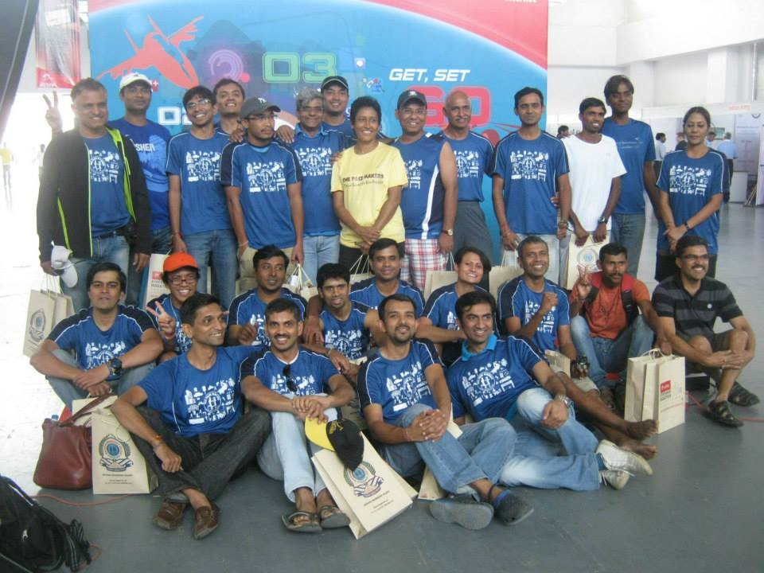
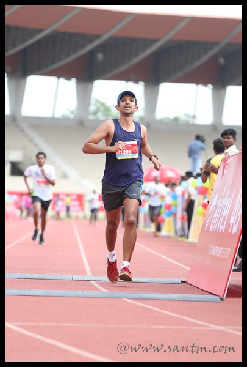
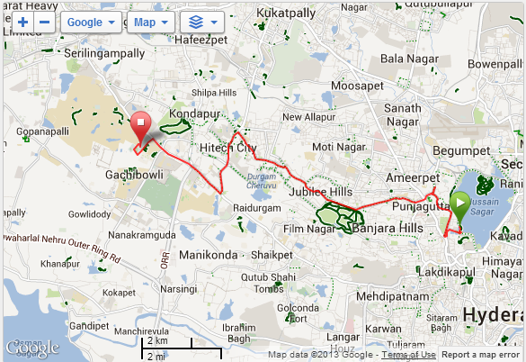
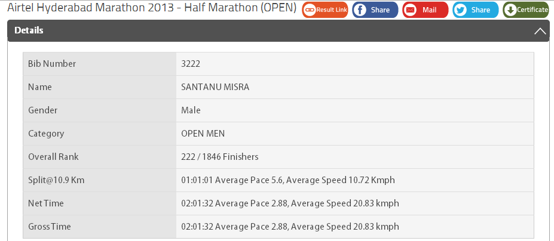
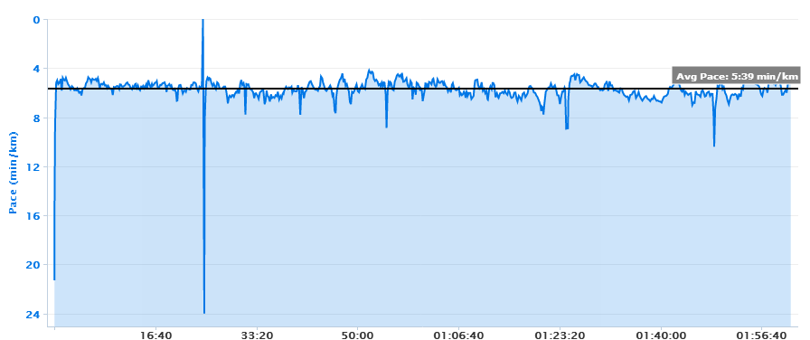

**Blessing** is a simple word, but last night (Monday), as I lay in bed, it reverberated in my thoughts. I wished for a gadget to record these musings, for I was too weary to use a keyboard or a voice recorder. Sometimes, we marvel, and even poke fun, at award ceremonies where individuals on stage offer their heartfelt thanks to those around them, even their pets at times. Personally, I find immense joy in reading the preface of a book, where authors express gratitude to their loved ones, early critics, and business partners. The Webby Awards, often considered the Oscars of the internet, keep it simple with their "5-word Acceptance Speeches" rule. My thoughts weren't dwelling on awards or long speeches; instead, they were focused on the people around me who enable me to savor my daily life in my own unique way.

Following a disappointing finish in the Bangalore TCS 10K (over 1 hour) and the Chennai Half Marathon (2:27 on my watch, 2:09 on the race website), I resolved to commit to training with Coach Kothandapani K C and the Pacemakers group. Previously, I would run with the group just once a week on weekends for a long run, and that too inconsistently. But for the past month, I've been leaving home at 4:30 AM to make it to Kanteerava Stadium for training sessions on Tuesdays and Thursdays. Tuesday is reserved for interval training, a challenge I'd never attempted when I first started running in the early 2000s. I struggled for weeks, but eventually, I began to see some improvement. However, there's still a long road ahead. On Thursdays, we engage in tempo runs and core strengthening exercises, which greatly benefit our running performance, as the core is the powerhouse of our bodies. Additionally, a couple of Nandi Hill runs on the weekends ensured that we were no longer intimidated by the upcoming Airtel Hyderabad Half Marathon's flyovers.

Recently, I asked my younger brother to ship me a pair of running shoes (size 4E - wide feet) and a Garmin GPS Watch. These items were personally carried to Bangalore by friends and colleagues from the US. These products are not readily available in India, and even when they are, they come at a hefty price.

I cannot express enough gratitude to Pamela, who has been an unwavering pillar of support. Nowadays, she moves faster than **Usain Bolt** on those two training days. She prepares breakfast, packs lunchboxes, and ensures that Aarush and herself are ready with a shower, breakfast, and out the door by 07:30 to get to school on time. Additionally, we're fortunate to have family members around who babysit Aarush on Saturdays, as we've shifted our long runs to Saturdays instead of Sundays.

The results speak for themselves. I completed the **Hyderabad Half Marathon** with strength, clocking 2:01:33 on my Garmin. This performance is my personal best in recent times, and I'm thrilled with the split timings for each kilometer. I maintained consistency throughout the race, with only a few kilometers where I ran slower than a 6-minute pace. During the final kilometer, I pushed myself, achieving a pace of around 5:10, overtaking a fellow runner from our group. It felt like winning the gold medal. Achieving this required hard work, determination, and strategy, but it wouldn't have been possible without these incredible people and their unwavering belief in me. I feel truly blessed.

The race itself was remarkable. I had the chance to meet some of India's finest runners from other cities. The arrangements for transport, train tickets, and hotel accommodations were top-notch. I'd like to extend special thanks to Coach and the Pacemakers team for their efforts. However, the post-race lunch is something I'll reminisce about for months to come. We dined at an unassuming restaurant called "[Dine Hill](http://www.dinehill.com/ "Dine Hill")." Initially, we were a bit hesitant, but once we stepped inside and saw people and their enormous plates, we experienced a culture shock. The dishes were so massive that they could accommodate 4-5 people eating from the same plate. When we asked the restaurant owner if we could have separate plates, he agreed but also encouraged us to try the communal style of sharing and eating food with friends, emphasizing that *love grows between friends*.

The journey was nothing short of amazing, and I can't help but feel grateful for every moment.